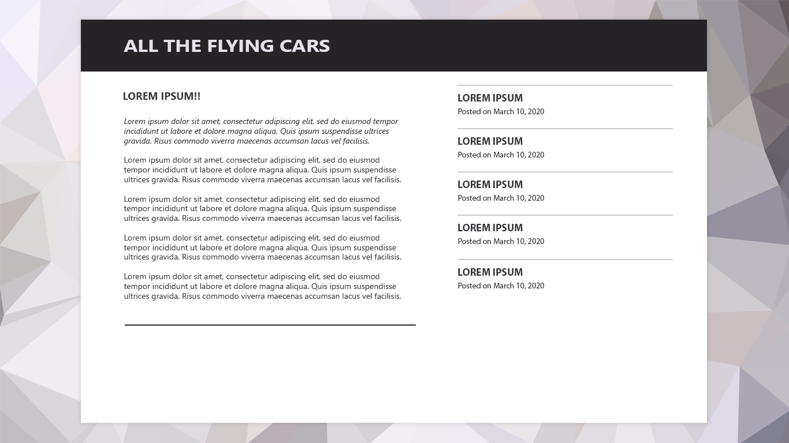

# Part 0
Clone branch part0 for the initial set up.


# Part 1

## Mocking Up a Tagline
1. Pretend you have this mockup from a designer

1. Mock it up in the browser.
```html
<h1>Get your own flying car today! <a href="">Read More &raquo;</a></h1>
```

```css
body {
    background: #DCDBD9;
    color: #2d2d2d;
    font: normal 100% Cambria, Georgia, serif;
}

h1 {
    font-size: 24px;
    font-style: italic;
}

h1 a {
    color: #747477;
    font: bold 11px Calibri, Optima, Arial, sans-serif;
    letter-spacing: 0.15em; /* 25px / 16px */
    text-transform: uppercase;
    text-decoration: none;
}
```
1. Pixels are fine... but they aren't flexible, so let's change this to something a little more
proportional...like `em`. Remember, the em unit is relative to the font-size of the element (ex. 2em is 2 times the font size of the current font).
1. How to get these from pixels to ems? `target / context = result` where target is the pixel font size in our comp, context is the font-size of the current containing element, and this will give us our result, which is the value we set using our em unit.
1. Assuming that setting the 100% font-size on our body elements makes everything 16px... we can just plug our values into our formula: 24 / 16 = 1.5. 24px is one and a half times bigger than 16px, so our new font-size is 1.5em.

```css
h1 {
    font-size: 1.5em;
    font-style: italic;
}
```
1. The font size should appear the same, but now it's relative and scaleable!
1. Time to move onto our anchor tag! Use the same formula. 11 / 24 = 0.4583333333
1. That's an awful number... but don't round it! Why would you? It's proportionally accurate. It's more proportional than if you had rounded it off to .46em. So let's add it to our CSS.
1. Why is this cool? Change font-size on body from 100% to 150%...everything scales!

## Okay...where's the grid though
Check out branch `step2-completed-basic-styling`

We've gotten this far and still haven't touched on the subject of grids, which is supposed to be what this section is about. BUT doing this with something simple like fonts will allow us to understand it and apply it to layouts and grids.

Let's pretend the graphic designer at your company has sent you a mockup that you are tasked with coding. For time's sake, we'll pretend that the basic colors, typography, and other details not related to layout are already completed.

The mockup:


